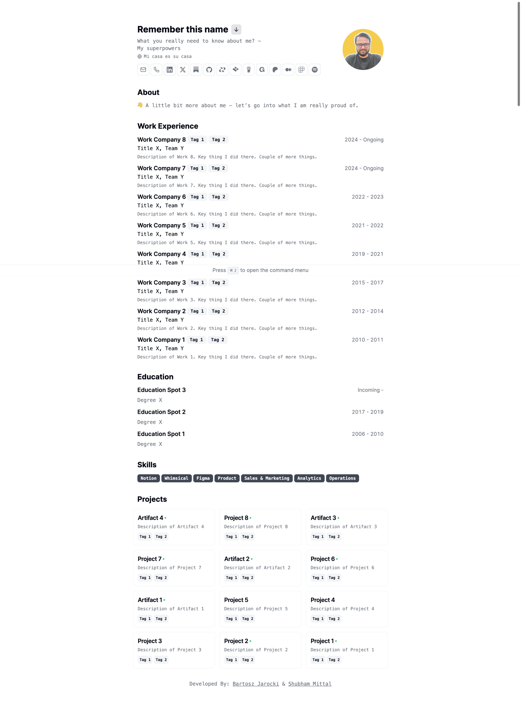

CV - Original    |CV - Notion Alternative
:-------------------------:|:-------------------------:
  |  

# Minimalist Notion-powered CV [](https://vercel.com/new/clone?repository-url=https://github.com/ApeDebugger/notionCV.git)

Managing a CV is also a job.

It's time to get rid of that additional node just to simply add your new job in your CV!

Now, integrate your online CV with your favourite personal workspace - Notion. With notion as your personal database, you can update your online CV in minutes.

Simple web app that renders minimalist CV with print-friendly layout & notion db as data source.

Built with Next.js, shadcn/ui & Notion API, deployed on Vercel.

# Features

- Setup only takes a few minutes with your choice of data source: [Notion DB](https://shubhammittal.notion.site/35d8fb9367934af69ca9a5f444518bb8?v=ef5a12840fc6496ea2e449a9e864b42a&pvs=4) OR [single data config file](./src/data/resume-data.tsx)
- Built using Next.js 14, React, Typescript, Shadcn/ui, TailwindCss & Notion API
- Data-updates from a Notion DB
- Auto generated Layout
- Responsive for different devices
- Optimized for Next.js and Vercel

# Getting Started Right Away (recommended for non-technical folks)

Follow this tutorial: [My online CV powered directly from my Notion workspace](https://shubhammittal.vercel.app/notes/build_your_online_cv_with_notion)

Want to see it happening: [1-min Demo: Update Online CV from Notion Database](https://www.loom.com/share/70bd77301304413b9d7edbdad40adfc2)

Finally, test it out: [Testing Playground for NotionCV](https://notioncv-playground.vercel.app)

# Getting Started Locally (recommended for technical folks)

1. Duplicate [Sample Notion DB](https://www.notion.so/shubhammittal/35d8fb9367934af69ca9a5f444518bb8?v=ef5a12840fc6496ea2e449a9e864b42a&pvs=4) to your Notion workspace.

2. Clone this repository to your local machine:

   ```bash
   git clone https://github.com/BartoszJarocki/cv.git
   ```

3. Move to the cloned directory

   ```bash
   cd cv
   ```

4. Create .env.local file in your cloned directory & add following environmental variables
   ```bash
   NOTION_TOKEN={NOTION_WORKSPACE_INTEGRATION_SECRET}
   NOTION_RESUME_DATABASE_ID={DATABASE_ID}
   ```

5. Install dependencies:

   ```bash
   npm install
   ```
   Or
   ```bash
   yarn install
   ```

6. Start the local Server:

   ```bash
   yarn dev
   ```

7. Open [Duplicated Notion DB](https://www.notion.so/shubhammittal/35d8fb9367934af69ca9a5f444518bb8?v=ef5a12840fc6496ea2e449a9e864b42a&pvs=4) OR/AND [Single Data Config file](./src/data/resume-data.tsx) and make changes

# Run with Docker

Build the container

```
docker compose build
```

Run the container

```
docker compose up -d
```

Stop the Container

```
docker compose down 
```

# Future Scope

We might work on following features if there is strong feedback from users. I'm open to receive collaboration requests if this intrigues anyone.

- Automatically create multiple variants for different roles & domain without leaving Notion:
    - Create a new key “CV Variants” in ResumeData
    - Populate “tags” field with the required variants like product, marketing, growth, chief of staff, etc.
    - Quickly select the data for the variant by selecting the keys using a single key instead of individual ones for each category - work, projects, social media, etc.
    - Data for the variant would be filtered using the appliedPage values like /{variant}.
- Launch in 4 steps on a single screen (without writing a single line of code):
    - Step 1: Github access to create a copy of [parent repository](https://github.com/ApeDebugger/notionCV.git) in your github account
    - Step 2: Notion access to duplicate [sample notion database](https://www.notion.so/35d8fb9367934af69ca9a5f444518bb8?pvs=21) in your notion workspace & automatically fetch ID of your ResumeData copy
    - Step 3: Notion API Token to connect your ResumeData to your vercel app
    - Step 4: Vercel access to create & launch your own CV powered from your own Notion workspace
    - Step 5: Update your online CV right from your favorite productivity tool “Notion”
    Optional Step: Update you online CV’s favicon by replacing the default ones - apple-icon.png & favicon.ico
- Select a CV layout template suitable for your needs:
    - Global default template from the current layout
    - Optional template with different layout or/and css
    - Select the template from Notion only

# License

[MIT](https://choosealicense.com/licenses/mit/)
